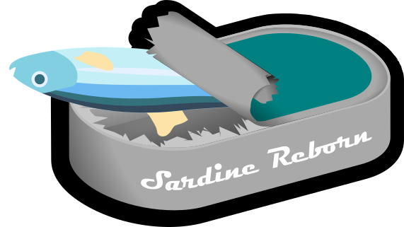
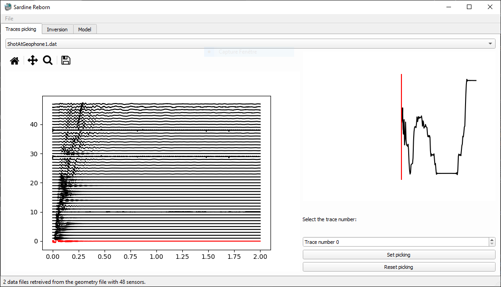
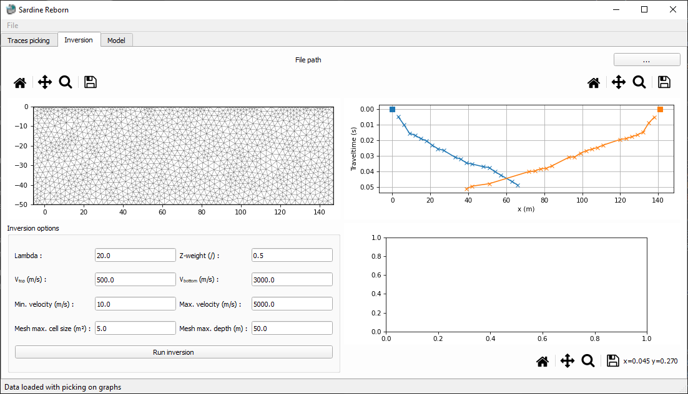
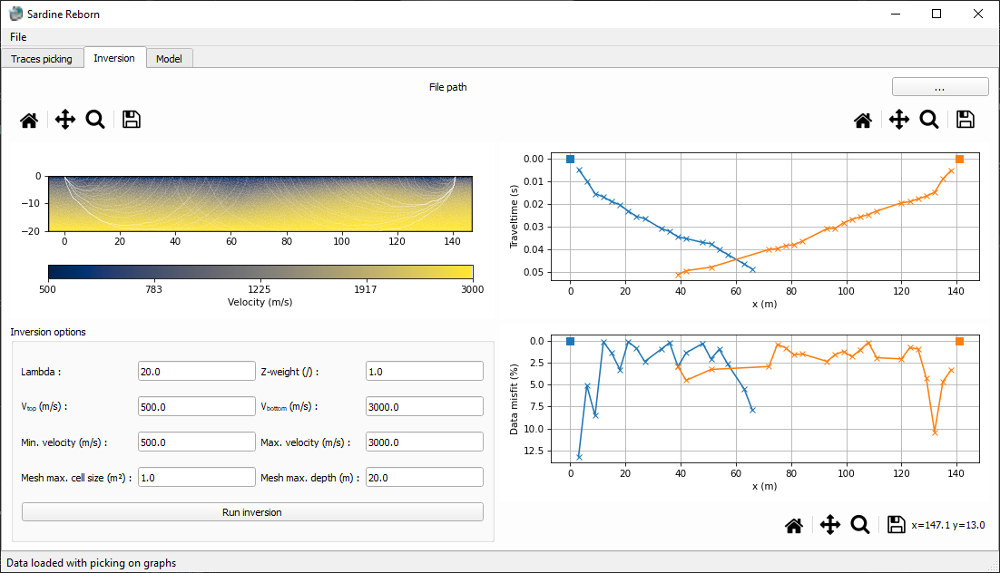
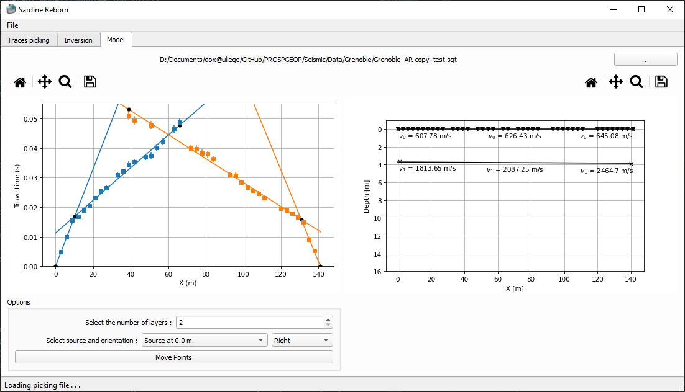

[](https://www.python.org/) [](https://github.com/hadrienmichel/SardineReborn) 

[](https://GitHub.com/hadrienmichel/SardineReborn/releases/) [](https://zenodo.org/badge/latestdoi/456904646)

[](https://GitHub.com/hadrienmichel/SardineReborn/commit/) [](https://GitHub.com/hadrienmichel/SardineReborn/commit/)
# Sardine Reborn

Sardine reborn is a new implementation of the Sardine software (Sardine v 1.0, ULiège (2000)). Sardine originaly stands for Seismic And Radar data INtErpretation.

This new implementation is fully devellopped in Python with a pyQT GUI. Currently, the software has limited functionalities but can be easily expended for custom needs (filtering, automatic picking, etc.).

## Functionalities
Sardine Reborn has several functionalities. All are oriented towards the more pedagogical aspect than for production-readyness. This means that very few actions are automated andthat the software is aimed as an hands-on approach to seismic refraction data.
- [Sardine Reborn](#sardine-reborn)
  - [Functionalities](#functionalities)
  - [Installation](#installation)
  - [Picking](#picking)
  - [Inversion](#inversion)
    - [Other options:](#other-options)
  - [Modelling](#modelling)
- [References:](#references)
- [Troubleshooting:](#troubleshooting)

Each of those functionalities have a dedicated tab in the UI. The user can save picking and models, as well as figures that are produced. 

## Installation
To install the package and code, download the code using this link:
[https://github.com/hadrienmichel/SardineReborn/archive/refs/tags/v0.3.0.zip](https://github.com/hadrienmichel/SardineReborn/archive/refs/tags/v0.3.0.zip). Un-zip the downloaded archive and locate the directory where it is placed (C:/my-directory)

In `Anaconda prompt` run the following command (the file `seismic.yml` must be in the current directory):
``` 
cd "C:/my-directory"
conda env create -f seismic.yml
```
This will create a new environement (called `seismic`) with the dependencies for the project.

Then, activate the environement:
```
conda activate seismic
```
Once the enviroement created, you can run the code by typing in the command line:
```
python Interface.pyw
```

The code will launch automatically.

__Attention: the current implementation of the code is not stable to user errors. Save your progresses along the way!__

__Above all, avoid accents and specific characters in the path that leads to your data and saving location as some dependencies of the code cannot work with those!__

## Picking


In the picking tab, you can load data from `*.segy` or `*.seg2` data (read operations done through [obspy](https://github.com/obspy/obspy)). To read a file, you must use a custom formatted header file that contains the informations about the files (extension = `*.geometry`). To load a `*.geometry` file, go to the menu `File` and select the option `Open geometry file` or press `CTRL+O`.

The formatting of the geometry file with `2` sources and `n` receivers is given in the snippet below:
```
SOURCES
Filename1.seg2   sourceX sourceY
Filename2.seg2   sourceX sourceY
RECEIVERS
r1X r1Y
r2X r2Y
...
rnX rnY
```

Note that for the current version, the geometry file only supports a single array of receivers with multiple sources. In the case of roll-alongs, you must use multiple geometry files and pick them separetly. It is then possible to merge them manually into a single *.sgt file and carry on with the inversion.

In the picking tab, two graphs will appear:
- The full seismic traces for the current source file.
- A zoomed-in visualization of the current trace.

The current trace is overlayed in red. The zoomed-in graph updates itself with the current X position of the mouse on the main graph. It helps to pick an accurate first-break of the trace. You can also use the zoom option on the main graph to zoom on a part of full traces and have a finer picking.

To select the first arrival, `left click` on the position. The position will be locked and represented in green on both graphs. By default, a 3% error is assigned (and showed) for all picking. You can select a custom error by `right clicking` on the upper (or lower) bound of the error.

You can change the source file by selecting the corresponding file in the drop-down menu at the top of the tab.

Once you are happy with the current picking, you can set the picking by selecting the `Set picking` button. To resume picking, click back on the same button. __It is strongly advised to set the picking to stop the animation process in the background an gain computing performances for the inversion!__ 

In case you want to begin back from scratch, you can select the `Reset picking` button to remove all picking.

Once everything is ready, you can save the picking into a `*.sgt` file (in the menu `File` select `Save Current Picking` or `CTRL+P`). This file uses the unified data formatting from [pyGIMLI](https://www.pygimli.org/). An exemple of the formatting is given in the snippet below:
```
20 # shot/geophone points
#x	y
0.00	0.00
3.00	0.00
6.00	0.00
9.00	0.00
12.00	0.00
15.00	0.00
18.00	0.00
21.00	0.00
24.00	0.00
27.00	0.00
33.00	0.00
36.00	0.00
39.00	0.00
42.00	0.00
48.00	0.00
51.00	0.00
54.00	0.00
57.00	0.00
60.00	0.00
63.00	0.00
19 # measurements
#s	g	t	err
1	2	0.006738	0.002257
1	3	0.011867	0.003385
1	4	0.015765	0.001436
1	5	0.017304	0.000821
1	6	0.019253	0.000923
1	7	0.020997	0.001539
1	8	0.024177	0.000616
1	9	0.026229	0.000923
1	10	0.027665	0.000821
1	11	0.031871	0.000616
1	12	0.031974	0.001436
1	13	0.034846	0.000821
1	14	0.036180	0.000718
1	15	0.037718	0.001334
1	16	0.039155	0.000616
1	17	0.041309	0.000051
1	18	0.042950	0.000718
1	19	0.045207	0.001539
1	20	0.046746	0.001128
```

You can have topography for the position of the geophones as those will be considered for the inversion. However, modelling does only work without topography!

Lastely, you can also load an already existing `*.sgt` file. In case the geometry corresponds with the already loaded signals, the picking will be displayed on top. Loading a `*.sgt` file will also initialize the inversion and modelling windows if possible.

## Inversion
The inversion of the first arrival is performed by interfacing the pyGIMLI API and giving access to the main inversion options. Travel-time tomography works better with mutliple sources and receivers but can still work with a limited number of sources. __Note that the results of the inversion might not result in an accurate estimation of the subsurface due to under-constraints on the model!__ 

To load an existing `*.sgt` file, use either of those 3 options:
- Menu `File` select `Load Picking File`
- Press `CTRL+L`
- Click on the `. . .` button

A mesh will automatically appear with the default parameters (maximum cell size of 5 m² and depth of 50 meters). The data will also be plotted.



You can change the inversion parameters in the `Inversion options` part of the tab. The different options are:
- `Lambda`: the regularization parameter. 
- `Z-weight`: the relative weight for vertical-to-horizontal regularization. 
- `V<sub>top</sub>` and `V<sub>bottom</sub>`: the top and bottom velocities for the start model (and by extension the reference model).
- `Min. velocity` and `Max. velocity`: the minimum and maximum velocities accepted in the inversion process.
- `Mesh max. cell size`: the maximum size of the cells in the created mesh.
- `Mesh max. depth`: the maximum depth (relative to the surface) of the mesh.

The different parameters have different effects on the inversion. The regularization parameter will apply a higher or lower weight to the variations of the obtained model in the objective function. A high regularization parameter will penalize small structures in the model. On the other hand, an underregularized inversion might lead to numerous artefacts in the inversion due to overfitting of the data. The vertical-to-horizontal regularization will reward horizontal (value lower than 1.0) or vertical (value above 1.0) features in the inversion model.

The starting model can have a huge impact on the results of the inversion. Therefore, it is important to select a starting model that is close to the a-priori idea of the site investigated. You can also have a uniform starting model by putting the top and bottom velocities to the same value.

In the case you might already know the geology relatively well, you can set the limits for the inversion velcoities accordingly. Leave this interval large in doubt.

For the mesh parameters, they will have an impact on the final model that is obtained. The finer the mesh, the better, but the longer to computational time. The deeper the mesh, the lower the chance of interferences from the boundary conditions on the inversion results. However, a finner and bigger mesh will lead to more difficult computations.

When all the parameters are selected, click the `Run inversion` button to run the inversion (using [pyGIMLI](https://www.pygimli.org/)).

### Other options:
In the `Inversion` menu, you can save the inversion mesh, the inversion results and responses, and the inversion. Those are done using the options:
- `Load Inversion Mesh`: Load an inversion mesh (GIMLi format)
- `Load Initial Model`: Load *.vector file that contains the velocities for each cells of the mesh.
- `Save Inversion Mesh`: Save the current inversion mesh (GIMLi format)
- `Save the Inverse Response`: Save the last inversion response (travel times)
- `Save the Inverse Results`: Save the last inversion model (velocities)
- `Save Inversion as VTK`: Save the inversion results in *vtk to read in paraview for changes in the visualization/ localization at large scale.




By playing with the different parameters, you will notice that they have a strong impact on the obtained inverse model. Finde the ideal set of parameters that suits your needs by comparing the misfit to the error on each points until you reach a satisfactory estimation.
## Modelling

The modelling of the data is perfomed using a simple Mota model (see: [Mota, 1954. Determination of dips and depths of geological layers by the seismic refraction method. Geophysics, 19 (2).](https://pubs.geoscienceworld.org/geophysics/article/19/2/242/67153/Determination-of-dips-and-depths-of-geological)). To load an existing `*.sgt` file, use either of those 3 options:
- Menu `File` select `Load Picking File`
- Press `CTRL+L`
- Click on the `. . .` button

Once the data is loaded, a first guess model is proposed. A first guess based on the maximum curvature is proposed.



You can change the model by moving the black points present in the hodochones graph. To do so, select a combination of source and orientation. Then, select `Move Points`. You can move freely all the points for this combination except from the first one (the source position). 

__Unselect `Move Points` when the selection is done to gain performances on the computer!__

You can also add a layer in the model by increasing the number in `Select the number of layers` box.


# References:
This code relies on several python libraries appart from the common numpy, matplotlib, etc.:
- ObsPy: used for the reading of the seismic traces

    Moritz Beyreuther, Robert Barsch, Lion Krischer, Tobias Megies, Yannik Behr and Joachim Wassermann (2010), [ObsPy: A Python Toolbox for Seismology](http://www.seismosoc.org/publications/SRL/SRL_81/srl_81-3_es/), _SRL_, 81(3), 530-533,  doi:`10.1785/gssrl.81.3.530`.
- pyGIMLI: used for the inversion of travel-time tomography

    Rücker, C., Günther, T., Wagner, F.M., 2017. [pyGIMLi: An open-source library for modelling and inversion in geophysics](http://www.sciencedirect.com/science/article/pii/S0098300417300584/pdfft?md5=44253eaacd5490e3fb32210671672496&pid=1-s2.0-S0098300417300584-main.pdf), _Computers and Geosciences_, 109, 106-123, doi:`10.1016/j.cageo.2017.07.011`.

# Troubleshooting:
Here are some common issues that can arise and how to troubelshoot them.

- I cannot read my seg2 files, even though they are correctly stated in the `*.geometry` file:

    The reading operations are performed using obspy.read. In case the seg2 file was written on a computer that is not setup in English, this can lead to inconsistancies in the date-time reading as those can be written in your language and not in English. 

    You can change this behaviour by adding the abbreviations for your language in the `header.py` file of obspy (`...\obspy\io\seg2\header.py`). In case this does not resolve the issue, report back and create an issue with the `*.geometry` file, the `*.seg2` file and a log of the error message that was provided in your terminal.

- More to be added... Please report issues you might enconter to help improve the code.